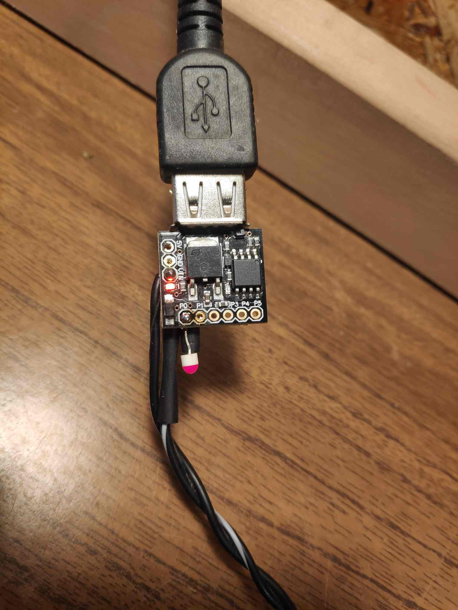

## Introduction

MCS Digistump Digispark Attiny 85 is the cheapest complete MCU board whose (five-euro) price is close to that of the MCU chip (Attiny 85) alone.


The problem is that its programming (flashing) [is not as trivial as it should be][why-im-not-using]. Most tutorials involve the [Arduino][bootloader] IDE, 
but those IDE-centered workflows depend on the IDE version number and are not flexible and portable enough. Here are some notes about programming this board directly from the Ubuntu 22.04 command line terminal.

## Flashing Code to MicroController

The [default setting][default-fuse-bits] is F_CPU=16500000 and all the pins of the port B are set to the output pins, this even includes the reset pin [PB5][datasheet]!

### Install gcc-avr tool chain:

```console
sudo apt-get install gcc build-essential gcc-avr binutils-avr avr-libc gdb-avr avrdude libusb-dev
```

### Install micronucleus:

```console
git clone https://github.com/micronucleus/micronucleus.git
cd micronucleus/commandline
make
```

Add this line to .bashrc (note your path to micronucleus, mine is /home/tokyo/):

```console
export PATH=$PATH:/home/tokyo/micronucleus/commandline
```

### Workflow:

#### Once (with USBasp or ISP):

Flash Micronucleus bootloader t85_default.hex.

Set the correct fuse values.

This establishes the board as a "Digispark". See 5. Updating Micronucleus.

#### Afterwards:

Use Micronucleus over USB to upload code:

```console
make clean
make
make install
```

or simply upload main.hex if you have obtained it by other means:

```console
sudo -E env "PATH=$PATH" micronucleus --run main.hex
```

The fuses remain as they were (you don’t touch them again).

In the included Makefile, ```make install``` runs sudo with the environment PATH borrowed from the user space 
so that the micronucleus program becomes visible.

The promt issues

```console
> Please plug in the device ...
```

and one then needs to unplug and plug the board to USB port again before succeeding:

```console 
> Device is found!
connecting: 33% complete
> Device has firmware version 1.6
> Available space for user applications: 6012 bytes
> Suggested sleep time between sending pages: 8ms
> Whole page count: 94  page size: 64
> Erase function sleep duration: 752ms
parsing: 50% complete
> Erasing the memory ...
erasing: 66% complete
> Starting to upload ...
writing: 83% complete
> Starting the user app ...
running: 100% complete
>> Micronucleus done. Thank you!
```

A sample code is included in this folder, see also [this minimal complete example][minimal-code].

Execute ```lsusb``` to check if the board is still visible on the USB port. If not, update/upload Micronucleus as shown below. 



### Updating Micronucleus

One problem with this board is that in order to update Micronucleus (bootloader), one still needs to wire an external ISP programmer such as USBasp to the corresponding pins MISO, MOSI, SCK and RESET. In order to update it:

cd micronucleus-master/firmware/releases

~~avrdude -P usb -c usbasp -p t85 -U flash:w:t85_default.hex~~

~~avrdude -P usb -c usbasp -p t85 -U lfuse:w:0x62:m -U hfuse:w:0xdf:m -U efuse:w:0xfe:m~~

~~This particular low fuse bit setting uses an internal 8 MHz oscillator with a division by 8 yielding F_CPU = 1000000u.~~

The above does not work. **Micronucleus expects 16.5 MHz.** Otherwise the USB signals are too slow and the USB device will not be detected. 

Instead:

```console
cd micronucleus-master/firmware/releases
avrdude -c usbasp -p t85 \
  -U flash:w:t85_default.hex:i \
  -U lfuse:w:0xe1:m \
  -U hfuse:w:0xdd:m \
  -U efuse:w:0xfe:m
```

Micronucleus is tied to specific fuses to run USB:

lfuse = 0xE1 → enable 16 MHz PLL clock, disable CKDIV8.

hfuse = 0xDD → keep reset pin enabled, set boot size properly.

efuse = 0xFE → default extended fuse.

**Always set the main clock to 16.5 MHz.**

6. Fuse Bits 

Fuse bits (fuses) = stored in a dedicated NVM area in the chip. Persistent w.r.t. resets and power on/off until explicitly changed. They also determine the CPU clock. `#define F_CPU 16500000UL` inside code/firmware only tells the compiler what we think the clock speed is. Has no effect on hardware, but affects certain functions such as `_delay_ms()`.

One should be extremely careful with the fuse bits. There are many ways to brick the device:
- Changing the lock bits. Only the omitted (shown above) or the default -U lock:w:0xFF:m is non-locking!
- High DWEN or RSTDISBL overrides RESET and will thus irreversibly break SPI and the ability to program!
- SPIEN should be 1, Enable Serial Program and Data Downloading, otherwise no SPI anymore!
- SELFPRGEN should be 1 if you want to use micronucleus.

I wish I read the articles [fuse-settings-general-1][fuse-settings-general-1] and [fuse-settings-general-2][fuse-settings-general-2] earlier.

## References

- [why-im-not-using]
- [bootloader]
- [minimal-code]
- [default-fuse-bits]
- [datasheet]
- [fuse-settings-general]
- [fuse-bit-calculator]

[why-im-not-using]: https://blog.mousetech.com/why-im-not-using-digisparks-attiny85-in-almost-everything/

[bootloader]: https://www.youtube.com/watch?v=RlscDz5JCcI

[minimal-code]: https://github.com/nabilbendafi/Digispark

[default-fuse-bits]: https://github.com/micronucleus/micronucleus/blob/master/firmware/configuration/t85_default/Makefile.inc

[datasheet]: https://ww1.microchip.com/downloads/en/DeviceDoc/Atmel-2586-AVR-8-bit-Microcontroller-ATtiny25-ATtiny45-ATtiny85_Datasheet.pdf

[fuse-settings-general]: http://www.martyncurrey.com/arduino-atmega-328p-fuse-settings/

[fuse-bit-calculator]: http://eleccelerator.com/fusecalc/fusecalc.php?chip=attiny85
